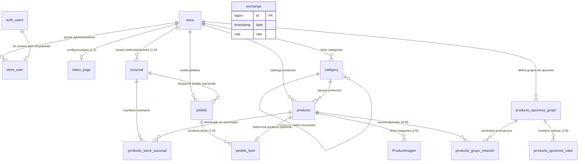

# Contexto del Backend: Base de Datos Supabase (PostgreSQL) 🗄️

Este documento describe la arquitectura de la base de datos, el modelo de entidades, sus relaciones y los flujos funcionales del backend para la plataforma e-commerce **Multi-Tenant y Marca Blanca**, implementada sobre **Supabase**.

> **Nota:** Este archivo contiene información sobre el esquema de base de datos y debe ser ignorado por el control de versiones (`.gitignore`).

---

## 📐 Arquitectura General del Backend

La base de datos está diseñada siguiendo un modelo **Multi-tenant (multitienda)** relacional en PostgreSQL:

1. **Aislamiento por Tienda (`store`)**: La tabla `store` actúa como la entidad raíz. Las entidades operativas (`sucursal`, `category`, `producto`, `producto_opciones_grupo`, `pedido`, `store_user`, `datos_pago`) se vinculan a una tienda mediante `store` / `store_id`.
2. **Arquitectura Multisucursal (`sucursal`)**: Cada tienda puede registrar 1 o N sucursales/almacenes independientes con su propia identidad fiscal (razón social, RIF/tax ID, dirección física) y contactos para gestión interna.
3. **Inventario Descentralizado por Almacén (`producto_stock_sucursal`)**: El producto pertenece a la tienda a nivel de catálogo, pero su disponibilidad física y nivel de stock se gestionan independientemente por cada sucursal.
4. **Acceso Frontend vía API Key**: Cada tienda posee un `api_key` (UUID único). El frontend público consulta los productos, categorías y configuración filtrando mediante esta clave.
5. **Manejo Multi-moneda Dual (USD / Bs)**: Se almacena el historial de tasas de cambio en `exchange` y los precios base en USD. Los pedidos calculan y respaldan los totales en ambas monedas (`total_usd` y `total_bs`).
6. **Variantes y Opciones Reutilizables**: Grupos de opciones (`producto_opciones_grupo`) y valores (`producto_opciones_valor`) vinculados a productos de forma N:M (`producto_grupo_relacion`).
7. **Historial Inmutable de Pedidos**: Registro de items comprados con un snapshot de sus precios y selecciones (`opciones_seleccionadas` en formato `JSONB`) en `pedido_item`, respaldando también la sucursal de despacho (`pedido.sucursal_id`).

---

## 📊 Diagrama de Entidad-Relación (ERD)

---

## 🧩 Detalle de Entidades y Tablas

### 1. Módulo Núcleo, Multi-Tenant y Multisucursal

#### `public.store` (Tienda / Negocio)
Es la tabla central que representa una tienda configurada en el sistema.
- **Campos Clave**: `id`, `comercial_name`, `domain`, `api_key`, `is_active`, `whatsapp`, `address`, `city`, branding (`color_primario`, `color_secundario`, `color_acento`, `font_family`), `logo_url`, `descripcion`.

#### `public.sucursal` (Sedes / Almacenes por Tienda)
Representa las distintas sucursales físicas o almacenes vinculados a una tienda.
- **Relaciones**: `store_id` ➔ `store(id)`.
- **Campos**:
  - `nombre` (text): Identificador comercial de la sede (ej: "Sucursal Chacao").
  - `codigo` (text): Código interno (ej: "SUC-001").
  - `razon_social` / `identificacion_fiscal`: Identidad fiscal/legal interna (RIF / Tax ID).
  - `direccion` / `ciudad` / `estado_provincia` / `codigo_postal`: Datos de ubicación fiscal y logística.
  - `telefono` / `email_contacto`: Contacto administrativo interno.
  - `es_principal` (boolean): Flag que identifica la sede principal.
  - `is_active` (boolean): Estado de la sucursal.

#### `public.store_user` (Administradores de Tienda)
- **Relaciones**: `store_id` ➔ `store(id)`, `user_id` ➔ `auth.users(id)`.

#### `public.datos_pago` (Información Bancaria)
- **Relaciones**: `store_id` (UNIQUE) ➔ `store(id)`.

---

### 2. Módulo de Catálogo e Inventario por Almacén

#### `public.category` (Categorías y Subcategorías Jerárquicas)
- **Relaciones**: 
  - `store` ➔ `store(id)`
  - `parent` ➔ `category(id)` (Clave foránea autorreferencial para estructurar árboles de subcategorías N-niveles).
- **Campos**: `id`, `name`, `slug`, `description`, `parent`, `thumbnails`, `created_at`.
- **Comportamiento**: Soporta jerarquía N-Niveles. El frontend resuelve recursivamente los productos de categorías padre e hijas.

#### `public.producto` (Productos del Catálogo General)
- **Relaciones**: `store` ➔ `store(id)`, `category` ➔ `category(id)`.
- **Campos**: `sku`, `slug`, `barcode`, `price`, `compare_price`, `is_active`, `description`, `name`, `precio_por_tamano`.

#### `public.producto_stock_sucursal` (Inventario por Sucursal/Almacén)
Tabla relacional que determina la existencia y disponibilidad de stock de un producto en cada almacén/sucursal.
- **Relaciones**: `producto_id` ➔ `producto(id)`, `sucursal_id` ➔ `sucursal(id)`.
- **Constraint**: Unique `(producto_id, sucursal_id)`.
- **Campos**:
  - `stock` (integer): Cantidad física disponible en este almacén.
  - `stock_minimo` (integer): Nivel mínimo para alertas de reabastecimiento.
  - `stock_status` (boolean): Disponibilidad de despacho activa para esta sucursal.

#### `public.ProductImagen` (Galería de Imágenes)
- **Relaciones**: `product` ➔ `producto(id)`.

---

### 3. Módulo de Personalización y Variantes

#### `public.producto_opciones_grupo` & `public.producto_opciones_valor`
- Define grupos de opciones (ej: Talla, Sabor, Toppings) y sus valores con modificador de precio en USD.

#### `public.producto_grupo_relacion` (Pivote N:M)
- Associa `producto` con `producto_opciones_grupo`.

---

### 4. Módulo Transaccional y Pedidos

#### `public.pedido` (Encabezado de Pedido)
- **Relaciones**: `store_id` ➔ `store(id)`, `sucursal_id` ➔ `sucursal(id)` (opcional, indica la sede emisora/despachadora).

#### `public.pedido_item` (Detalle del Pedido)
- **Relaciones**: `pedido_id` ➔ `pedido(id)`, `producto_id` ➔ `producto(id)`.
- **Campos**: `nombre_producto`, `cantidad`, `precio_unitario`, `comentario`, `opciones_seleccionadas` (`jsonb`).

---

### 5. Módulo Financiero

#### `public.exchange` (Tasa de Cambio)
- Registra el historial de tasas USD/Bs.
